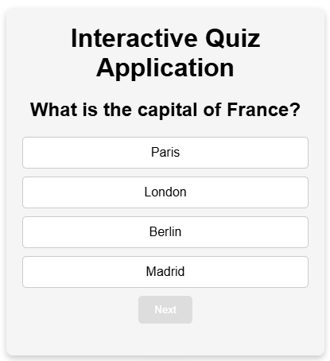

# Interactive Quiz Application
#### Welcome to the Interactive Quiz Application! This project is designed to provide a fun and engaging way to test your knowledge through quizzes. It is built using HTML, CSS, and JavaScript, making it a great project for beginners and experienced developers alike.

# Live Demo
#### [View the live demo](https://quiz-application-said.vercel.app)

# Table of Contents
### Features
### Technologies Used
### Usage
### Contributing
### License

# Features
- Interactive Quiz: Users can answer multiple-choice questions and receive immediate feedback.
- Dynamic Question Display: Questions are displayed one at a time, enhancing user engagement.
- Responsive Design: The application is designed to work on various devices, including desktops and mobile phones.

# Technologies Used
- HTML: For the structure of the application.
- CSS: For styling and layout.
- JavaScript: For functionality and interactivity.

# Usage
#### Once the application is open in your browser, you can start the quiz by clicking the "Start" button. Answer the questions by clicking on the answer buttons. After answering, you will receive feedback on whether your answer was correct or not. At the end of the quiz, you will be notified that the quiz is finished.

# Contributing
#### Contributions are welcome! If you have suggestions for improvements or want to add new features, please fork the repository and submit a pull request.

# License
#### This project is licensed under the MIT License. See the LICENSE file for details.